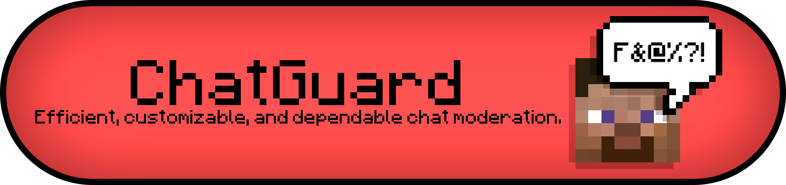

# 🛡️ ChatGuard

## ✨ Features
### Content Filtering
Configurable terms and regex patterns
- 🛑 Blocks chat messages containing inappropriate content
- 🪧 Censors signs containing inappropriate content
- 👤 Prevents players from joining with inappropriate usernames

### Player Feedback & Notifications
- 🔊 Plays audio cues to notify offending players when violations occur
- 💬️ Sends warning messages to players explaining why content was blocked

### Moderation System
- ⚠️ Multi-tier strike system for tracking repeat offenders
- 🔇 Issues temporary mutes with escalating durations based on current strike tier
- ⏱️ Configurable mute durations for each strike tier
- 🛠️ Staff commands to view and set player strikes manually

### Logging & Monitoring
- 📱 Discord webhook integration with customizable embeds
- 💻 Console logging with detailed information
- 📄 Local file logging for record-keeping
